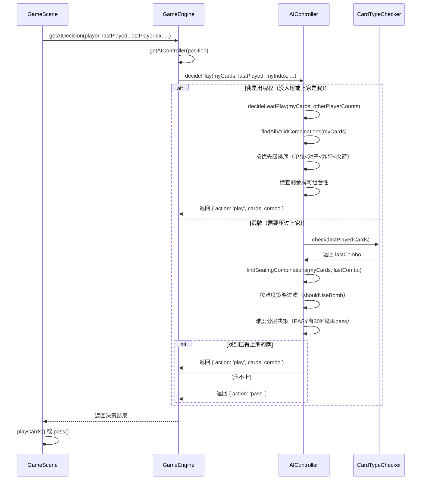
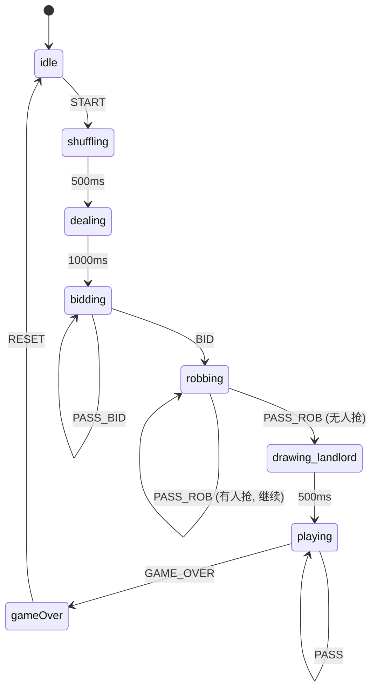

# 斗地主 H5 游戏技术分享

> 基于 Phaser.js 3.x + TypeScript + XState 的斗地主游戏架构分析

---

## 项目架构总览

### 分层结构

项目采用 **分层 + 模块化** 设计，各层职责清晰、依赖方向单一（上层依赖下层）：

| 目录 | 职责 | 核心文件 |
|---|---|---|
| `types/` | 纯类型定义层，提供枚举和接口 | `index.ts` |
| `utils/` | 游戏核心逻辑层，与渲染无关 | `Card` / `Deck` / `CardTypeChecker` / `GameEngine` / `CardCounter` / `ScoreManager` / `AutoPlayManager` |
| `ai/` | AI 决策层，封装出牌/叫地主/抢地主策略 | `AIController` |
| `states/` | 状态管理层，基于 XState 实现有限状态机 | `GameStateMachine.ts` |
| `scenes/` | 渲染层，基于 Phaser Scene 实现 UI 交互 | `MenuScene` / `GameScene` / `GameOverScene` |

### 依赖关系

```
scenes (GameScene)
  ├── states (GameStateMachine)
  │     ├── types
  │     └── utils (Card, Deck)
  ├── ai (AIController)
  │     ├── types
  │     └── utils (Card, CardTypeChecker)
  └── utils
        ├── Card / Deck / CardTypeChecker / GameEngine
        ├── CardCounter / ScoreManager / AutoPlayManager
        └── types
```

**关键设计原则：**

- `types/` 是最底层，**不依赖任何其他模块**，保证类型契约的稳定性
- `utils/` 只依赖 `types/`，是纯逻辑层，可独立测试
- `ai/` 依赖 `utils/CardTypeChecker`，AI 决策需要牌型判定能力
- `states/` 依赖 `utils/Card` 和 `utils/Deck`，状态机在 transition 中直接创建 Deck
- `scenes/` 是最顶层，**直接依赖所有层**，承担渲染 + 调度 + 事件分发职责

### 核心数据流

```
用户点击出牌按钮
    ↓
GameScene → 调用 GameEngine.canPlayCards() 校验
    ↓
GameEngine → CardTypeChecker 判定牌型 + canBeat 比较
    ↓
校验通过 → GameScene.playCards() → 更新 UI
    ↓
下一位玩家 → GameEngine.getAIDecision() → AIController.decidePlay()
    ↓
AIController → findBeatingCombinations() → 返回最优出牌
    ↓
GameScene 渲染 AI 出牌 → 循环直到一方出完
```

---

## 牌型判定逻辑详解

`CardTypeChecker`（`src/utils/CardTypeChecker.ts`）是整个游戏的核心算法模块，支持 **14 种牌型**。判定顺序**严格从上到下**（优先级递减），一旦匹配成功即返回。

### 支持的牌型一览

| 牌型 | 英文标识 | 判定条件 | 主值比较规则 | 说明 |
|---|---|---|---|---|
| 火箭 | `rocket` | 2 张：大王 + 小王 | 不可被普通牌压 | 最大牌型，任何牌都压不过 |
| 炸弹 | `bomb` | 4 张，点数完全相同 | 点数大的压点数小的 | 可压任何非炸弹牌型 |
| 单张 | `single` | 1 张牌 | 点数大的压点数小的 | |
| 对子 | `pair` | 2 张，点数相同 | 点数大的压点数小的 | |
| 三张 | `triple` | 3 张，点数相同 | 点数大的压点数小的 | 极少单独出 |
| 三带一 | `triple_one` | 4 张：3 张相同 + 1 张不同 | 以三张的点数比较 | 附带牌不参与比较 |
| 三带二 | `triple_pair` | 5 张：3 张相同 + 1 对子 | 以三张的点数比较 | 对子不参与比较 |
| 顺子 | `straight` | ≥5 张，连续递增，不含 2 和王 | 以最大点数比较 | 5~12 张均可 |
| 连对 | `straight_pair` | ≥3 对，连续递增，不含 2 和王 | 以最大对子点数比较 | 必须偶数张 |
| 飞机 | `plane` | ≥2 组连续三张，不含 2 和王 | 以最大三张点数比较 | 纯飞机 |
| 飞机带单 | `plane_single` | 飞机 + 同等数量的单张 | 以飞机的最大点数比较 | |
| 飞机带对 | `plane_pair` | 飞机 + 同等数量的对子 | 以飞机的最大点数比较 | |
| 四带二 | `four_two` | 6 张：4 张相同 + 2 张单 | 以四张的点数比较 | |
| 四带两对 | `four_two_pair` | 8 张：4 张相同 + 2 对 | 以四张的点数比较 | |

### 判定流程（check 方法）

```
输入 cards
  ↓
按降序排序
  ↓
依次尝试 14 种 isXxx 方法
  ↓
一旦匹配 → 返回 { type, mainValue, length, cards }
  ↓
全部不匹配 → 返回 { type: invalid }
```

### "能否压过上家"逻辑（canBeat）

`canBeat(current, last)` 的比较规则在 `compareCombination` 中实现：

```
1. last 是火箭 → 任何牌都压不过（返回 true 表示 last 能压 current）
2. current 是火箭 → 火箭能压任何非火箭牌（返回 false 表示 current 能压 last）
3. last 是炸弹 → 非炸弹压不过炸弹；都是炸弹则比点数
4. 其他情况 → 类型必须相同 + 长度必须相同 + current.mainValue > last.mainValue
```

**关键代码逻辑**（`CardTypeChecker.ts:150-196`）：

```typescript
static compareCombination(a: ICardCombination, b: ICardCombination): boolean {
  // b 是 last，a 是 current
  if (b.type === ROCKET) return true;    // last 是火箭，current 压不过
  if (a.type === ROCKET) return false;   // current 是火箭，能压
  if (b.type === BOMB) {
    if (a.type !== BOMB) return true;    // 非炸弹压不过炸弹
    return b.mainValue >= a.mainValue;   // 都是炸弹，比点数
  }
  if (a.type === BOMB) return false;     // current 是炸弹，能压非炸弹
  // 同类型同长度 → 比 mainValue
  if (a.type !== b.type || a.length !== b.length) return false;
  return b.mainValue > a.mainValue;      // b.mainValue > a.mainValue 表示 b 能压 a
}
```

> ⚠️ **注意**：`compareCombination` 返回 `true` 表示 `b`（上家）能压过 `a`（当前），返回 `false` 表示 `a` 能压过 `b`。语义容易混淆。

### 炸弹和火箭的特殊处理

炸弹和火箭的优先级判断在 `compareCombination` 的 **最前面**：

1. **火箭**：`isRocket` 优先判定（仅需 2 张：大王+小王），`check` 方法中火箭最先被匹配
2. **炸弹**：`isBomb` 次优先（4 张相同点数），在判定普通牌型之前拦截
3. **炸弹 vs 炸弹**：通过 `mainValue`（炸弹点数）比较
4. **火箭 vs 任何牌**：火箭永远最大，`compareCombination` 中 `a.type === ROCKET` 直接返回 `false`

在 AI 层，`shouldUseBomb` 方法（`AIController.ts:241-267`）根据难度策略决定何时出炸弹：

| 难度 | 出炸弹条件 |
|---|---|
| EASY | 手牌 ≤ 6 张且炸弹 ≥ 2 个 |
| MEDIUM | 手牌 ≤ 8 张且炸弹 ≥ 1 个 |
| HARD | 手牌 ≤ 10 张或炸弹 ≥ 2 个 |

---

## AI 决策流程



### AI 决策入口

AI 决策的完整链路：

```
GameScene.processAIPlay()         [src/scenes/GameScene.ts:1163]
  → GameEngine.getAIDecision()     [src/utils/GameEngine.ts:39]
      → AIController.decidePlay()  [src/ai/AIController.ts:102]
          ├─ decideLeadPlay()      （我是出牌权）
          └─ decideFollowPlay()    （跟牌）
```

### "必须出牌"与"可以选择不出"的区别

| 场景 | 触发条件 | AI 行为 |
|---|---|---|
| 必须出牌 | `lastPlayedCards.length === 0` 或 `lastPlayerIndex === myIndex` | `decideLeadPlay()`：从所有合法组合中选最优，**永远不会 pass** |
| 可选择不出 | 有上家出牌且不是我 | `decideFollowPlay()`：找压得上家的牌，**根据难度决定是否 pass** |

**必须出牌（decideLeadPlay）策略：**

1. 找出手牌中所有合法组合（单张、对子、三张、顺子、连对、飞机、炸弹等）
2. 按优先级排序：火箭 > 炸弹 > 其他牌型，同类型按 mainValue 升序
3. 检查出此牌后剩余手牌是否仍有可组合性（避免出一次牌后完全散架）
4. 若对手剩牌 ≤ 2 张，放宽条件（直接压）

**可选择不出（decideFollowPlay）策略：**

1. 先判定上家牌型 `check(lastPlayedCards)`
2. 找所有能压过的组合 `findBeatingCombinations()`
3. 过滤规则：
   - 火箭仅在对手剩牌少或不得不出时使用
   - 炸弹仅在 `shouldUseBomb` 判断为 true 时使用
4. **难度差异化**：

| 难度 | 跟牌策略 |
|---|---|
| EASY | 30% 概率出最小的能压的牌；50% 概率不出 |
| MEDIUM | 对手剩牌少时必出；20% 概率出；40% 概率不出 |
| HARD | 优先出非炸弹组合；只有 `shouldUseBomb` 时才出炸弹；谨慎 pass |

### 叫地主决策（decideBid）

根据手牌质量评估得分 `evaluateHand()`（满分 100），按难度门槛决定叫分：

- **EASY**：70 分以上叫 300 分，40 分以上有 50% 概率叫 100 分
- **MEDIUM**：80 分以上叫 300 分，60 分以上叫 200 分
- **HARD**：85 分以上叫 300 分，50 分以上必叫 100 分

评估维度：双王(+40) / 大王(+15) / 小王(+10) / 2的数量(+10/张) / 炸弹(+20) / 三张(+5) / 顺子(+2/张) / 连对(+3/对)

### 抢地主决策（decideRob）

同样基于 `evaluateHand()` 得分，高难度抢地主的门槛更低（更激进）：

| 难度 | 抢地主条件 |
|---|---|
| EASY | ≥75 分且 30% 概率 |
| MEDIUM | ≥70 分必抢，≥55 分 40% 概率 |
| HARD | ≥65 分必抢，≥50 分 30% 概率 |

---

## 状态机流转图



### 状态机核心结构

`GameStateMachine`（`src/states/GameStateMachine.ts`）基于 XState v5 实现，定义了 **8 个状态节点** 和 **10 种事件**。

### 状态流转详解

| 当前状态 | 触发事件 | 目标状态 | 关键 assign 动作 |
|---|---|---|---|
| `idle` | `START` | `shuffling` | 创建 Deck 发牌、初始化 3 个玩家、重置 context |
| `shuffling` | 500ms after | `dealing` | 更新 gameLog |
| `dealing` | 1000ms after | `bidding` | 随机选起始玩家、更新 gameLog |
| `bidding` | `BID` | `robbing` | 记录 bidHistory、计算 multiplier、切换到下一玩家 |
| `bidding` | `PASS_BID` | `bidding` | 记录 passedPlayers、若 3 人都 pass 则重置 |
| `robbing` | `ROB` | `robbing` | multiplier×2、更新 landlordIndex |
| `robbing` | `PASS_ROB` | `drawing_landlord` | 若有抢地主的 → 确定地主；若无抢但有叫分 → 叫分最高者为地主 |
| `drawing_landlord` | 500ms after | `playing` | 地主获得 3 张底牌、排序手牌、重置出牌标记 |
| `playing` | `PLAY_CARDS` | `playing` | 扣除已出的牌、记录 lastPlayedCards、重置 passedPlayers |
| `playing` | `PASS` | `playing` | 记录 passedPlayers、切换当前玩家 |
| `playing` | `GAME_OVER` | `gameOver` | 计算分数变化、更新玩家分数 |
| `gameOver` | `RESET` | `idle` | 重置 context |

### 主线上的关键 assign 动作

**叫地主 → 抢地主 → 出牌** 这条主线中，最关键的 assign 动作：

1. **叫地主阶段**：`BID` 事件会把倍数从基础分（100）提升到 1/2/3 倍（`multiplier = bid.score / 100`）
2. **抢地主阶段**：每次成功抢地主，`multiplier *= 2`，倍数翻倍
3. **确定地主**：`PASS_ROB` 中若所有其他玩家都不抢，将叫分最高者设为地主，并把 3 张底牌合并进地主手牌
4. **出牌阶段**：`PLAY_CARDS` 会重置 `passedPlayers = []`（新一轮出牌开始），更新 `lastPlayedCards` 和 `lastPlayerIndex`
5. **结束阶段**：`gameOver` 中按 `landlord`/`farmer` 身份计算分数变化（地主得分/扣分×2）

---

## 潜在风险点

### 风险 1：GameScene 与 GameStateMachine 职责重叠，状态机几乎未被使用

**问题描述**：`GameStateMachine` 已经定义了完整的状态流转逻辑，但 `GameScene` 完全没有使用它。`GameScene` 自己维护了一套 `gamePhase` 变量（`'idle' | 'dealing' | 'bidding' | 'robbing' | 'playing' | 'gameOver'`），并用 `if/else` 分支手动控制流程。

**影响**：
- 状态机成了死代码，增加了维护负担
- `GameScene` 中状态流转逻辑散落在 `startBidding`、`startRobbing`、`processAIBid`、`processAIRob`、`processAIPlay` 等多个方法中，代码冗余且易出错
- 两处状态定义不同步（XState 有 `shuffling`/`drawing_landlord`，但 `gamePhase` 没有），未来扩展时容易遗漏

**建议**：要么删除 `GameStateMachine` 避免维护两套逻辑，要么将 `GameScene` 改造为状态机驱动的架构。后者更推荐——Phaser 的 `scene.state` 可以与 XState 的状态同步。

---

### 风险 2：CardTypeChecker 的判定顺序容易引入 Bug

**问题描述**：`CardTypeChecker.check()` 方法中，牌型判定是**从上到下**依次尝试的。如果某人想在中间插入一种新牌型，很容易因为顺序问题导致某牌型永远无法匹配（比如"四带二"会在"三带一"之后被 `isTripleOne` 错误匹配，因为 6 张牌可能包含 3+1+1+1 而非 4+2）。

更严重的是：`isStraightPair` 中 `mainValue` 返回的是**最大点数**而不是**最小点数**（`values[values.length - 1]`），而 `isStraight` 中返回的是**最小点数**。这种不一致可能在比较时产生难以察觉的错误。

**影响**：
- 新增牌型时容易破坏已有匹配
- 连对（straight_pair）的 mainValue 语义与其他牌型不一致，可能导致 canBeat 比较出错
- `compareCombination` 方法使用 `a.mainValue - b.mainValue` 做差比较，但连对的 mainValue 是最大点数，其他顺子是最小点数，语义不统一

**建议**：统一所有牌型的 `mainValue` 语义（比如都返回最小值），或在比较时根据 type 做映射。同时增加单元测试覆盖所有牌型的 canBeat 场景。

---

### 风险 3：GameScene 中的 AI 强制出牌逻辑与 AI 决策冲突

**问题描述**：在 `GameScene.processAIPlay()`（第 1179-1188 行）中，当 AI 返回 `pass` 时，如果满足 "必须出牌" 条件（没人压或上家是自己），代码会**强制出最后一张牌**：

```typescript
if (decision.action === 'play' && decision.cards) {
  this.playCards(this.currentPlayerIndex, decision.cards);
} else {
  if (this.lastPlayedCards.length === 0 || this.lastPlayerIndex === this.currentPlayerIndex) {
    const anyCard = player.cards[player.cards.length - 1];
    this.playCards(this.currentPlayerIndex, [anyCard]);  // 强制出最后一张
  } else {
    this.pass(this.currentPlayerIndex);
  }
}
```

然而在 `AIController.decideLeadPlay()` 中（第 124-126 行），AI 只有在 `combinations.length === 0`（手牌中没有任何合法组合）时才会返回 pass。手牌为 0 的情况意味着玩家已经出完了，所以这个强制逻辑**理论上永远不会被触发**——除非 AI 的组合生成算法有遗漏。

**影响**：
- 这是一个防御性代码，掩盖了 `findAllValidCombinations` 可能漏掉某些牌型组合的问题
- 强制出最后一张牌的策略可能不是最优决策，应该让 AI 决策层处理这种 edge case
- 如果 AI 的组合生成算法有 bug，这个"安全网"会让问题被隐藏

**建议**：在 `decideLeadPlay` 返回 pass 时打 warn 日志，并追踪原因，确认是算法遗漏还是正常情况。如果是算法遗漏，应修复 `findAllValidCombinations` 而不是在 Scene 层做兜底。

---

### 风险 4（附加）：ScoreManager 与 GameEngine 中的 rankConfigs 重复定义

`ScoreManager.ts` 和 `GameEngine.ts` 中各有一份 `RANK_CONFIGS` 定义（段位配置），内容完全相同但互不关联。修改一处容易忘记修改另一处，导致 `getRankInfo` 和 `getRankByScore` 返回不一致的结果。建议抽取到 `types/index.ts` 或单一模块中统一导出。
