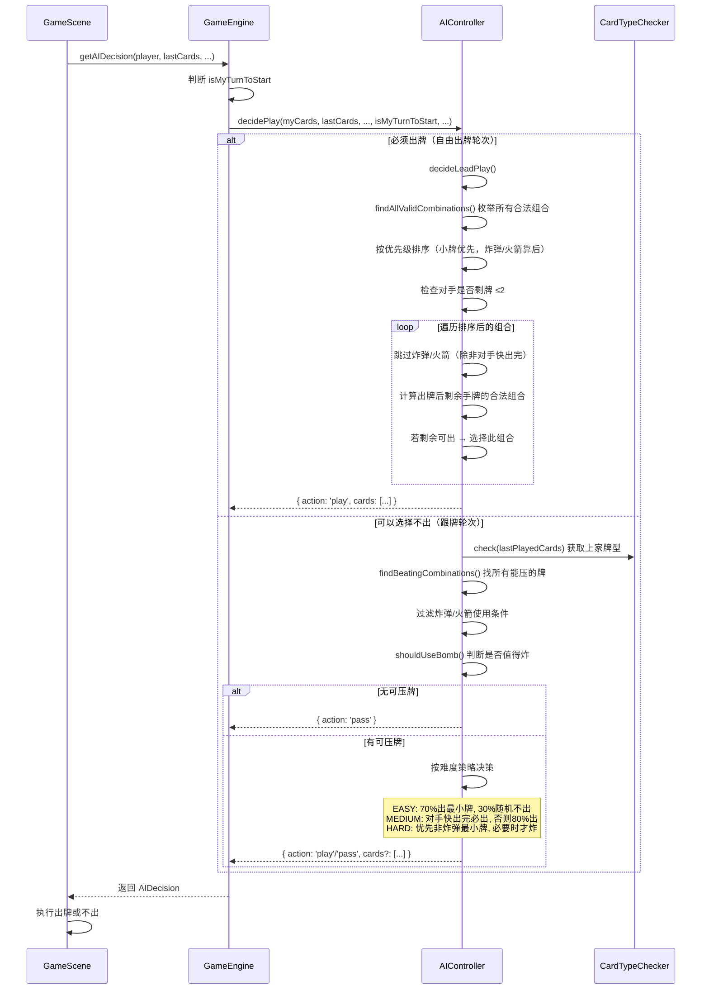
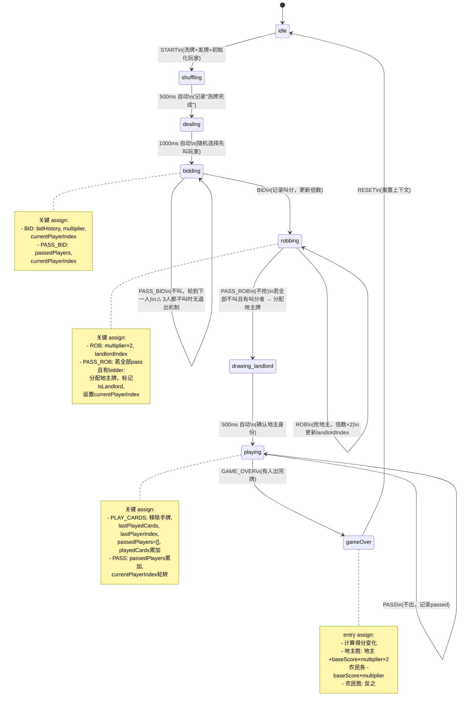

# 斗地主 H5 游戏技术架构分析

---

## 项目架构总览

### 目录结构

```
src/
├── main.ts                 # 入口文件，Phaser 游戏配置
├── types/
│   └── index.ts            # 全局类型定义（枚举、接口）
├── ai/
│   └── AIController.ts     # AI 决策控制器
├── scenes/
│   ├── MenuScene.ts        # 主菜单场景
│   ├── GameScene.ts        # 核心游戏场景（~1200行）
│   └── GameOverScene.ts    # 游戏结束场景
├── states/
│   └── GameStateMachine.ts # XState 状态机定义（⚠️ 未被使用）
└── utils/
    ├── Card.ts             # 扑克牌模型与排序
    ├── CardTypeChecker.ts  # 牌型判定与比较
    ├── CardCounter.ts      # 记牌器（已出/剩余统计）
    ├── Deck.ts             # 牌组初始化、洗牌、发牌
    ├── GameEngine.ts       # 游戏引擎（AI 调度、规则校验）
    ├── AutoPlayManager.ts  # 托管管理器（包装 AIController）
    └── ScoreManager.ts     # 积分/段位/排行榜（localStorage）
```

### 各层职责

| 层 | 目录 | 职责 |
|---|---|---|
| **类型层** | `types/` | 定义所有枚举（CardSuit, CardRank, CardType, GameState, Difficulty 等）和接口（ICard, IPlayer, ICardCombination, IGameContext 等），是整个项目的基础契约 |
| **工具层** | `utils/` | 核心游戏逻辑：牌的创建/排序（Card）、牌型判定/比较（CardTypeChecker）、发牌（Deck）、记牌（CardCounter）、积分管理（ScoreManager）、AI 调度（GameEngine）、托管（AutoPlayManager） |
| **AI 层** | `ai/` | AI 决策逻辑：叫地主/抢地主/出牌的完整决策流程，按难度分级 |
| **状态层** | `states/` | XState 状态机定义，描述游戏从 idle → shuffling → dealing → bidding → robbing → drawing_landlord → playing → gameOver 的完整生命周期 |
| **场景层** | `scenes/` | Phaser 游戏场景，负责渲染和用户交互，是 UI 和逻辑的胶水层 |

### 依赖关系图

```
scenes/GameScene ──→ utils/GameEngine ──→ ai/AIController ──→ utils/CardTypeChecker
      │                    │                                      │
      │                    └──→ utils/Card                         │
      │                    └──→ utils/Deck ──→ utils/Card          │
      ├─→ utils/CardCounter ──→ utils/Card                        │
      ├─→ utils/AutoPlayManager ──→ ai/AIController               │
      ├─→ utils/ScoreManager                                      │
      └─→ utils/Card                                              │
                                                                     ↓
states/GameStateMachine ──→ utils/Deck, utils/Card            types/index.ts
                                                                     ↑
                    所有模块 ──────────────────────────────→ types/index.ts
```

**关键发现**：`GameStateMachine` 已定义但 **GameScene 并未使用它**，GameScene 通过自身的 `gamePhase` 字符串属性自行管理状态，与状态机形成了**双轨并行**的架构问题（详见潜在风险点）。

---

## 牌型判定逻辑详解

### 支持的牌型一览

| 牌型 | 枚举值 | 牌数 | 判定条件 | mainValue 取值 |
|---|---|---|---|---|
| 火箭 | `ROCKET` | 2 | 大小王（value=17 + value=16） | 17（JOKER_BIG） |
| 炸弹 | `BOMB` | 4 | 4 张 value 完全相同的牌 | 该牌的 value |
| 单张 | `SINGLE` | 1 | 任意 1 张牌 | 该牌的 value |
| 对子 | `PAIR` | 2 | 2 张 value 相同的牌 | 该牌的 value |
| 三张 | `TRIPLE` | 3 | 3 张 value 相同的牌 | 该牌的 value |
| 三带一 | `TRIPLE_ONE` | 4 | 存在 1 组 count=3 的 value，其余为 1 张 | 三张的 value |
| 三带二 | `TRIPLE_PAIR` | 5 | 存在 1 组 count=3 + 1 组 count=2 | 三张的 value |
| 顺子 | `STRAIGHT` | ≥5 | 所有 value 唯一、连续、不含 2/王 | 最小 value |
| 连对 | `STRAIGHT_PAIR` | ≥6(偶数) | 每个 value 恰好 2 张，连续、不含 2/王 | 最大 value |
| 飞机 | `PLANE` | ≥6(3的倍数) | ≥2 组 count=3 的 value 连续、不含 2/王，且无其他牌 | 最大三张 value |
| 飞机带单 | `PLANE_SINGLE` | ≥8 | ≥2 组连续三张 + 等量单张（count=1），无其他类型 | 最大三张 value |
| 飞机带对 | `PLANE_PAIR` | ≥10 | ≥2 组连续三张 + 等量对子（count=2），无其他类型 | 最大三张 value |
| 四带二 | `FOUR_TWO` | 6 | 1 组 count=4 + 任意 2 张 | 四张的 value |
| 四带二对 | `FOUR_TWO_PAIR` | 8 | 1 组 count=4 + 2 组 count=2 | 四张的 value |
| 无效 | `INVALID` | - | 不匹配以上任何牌型 | 0 |

### canBeat 比较规则

`canBeat(current, last)` 判断 current 牌组能否压过 last 牌组，内部调用 `compareCombination(lastCombo, currentCombo)`：

| 步骤 | 条件 | 结果 |
|---|---|---|
| 1 | current 为空 | ❌ 不能出 |
| 2 | last 为空（自由出牌） | ✅ 只要 current 牌型合法即可 |
| 3 | 任一方为 INVALID | ❌ 不能压 |
| 4 | current 是火箭 | ✅ 火箭最大，压一切 |
| 5 | last 是火箭 | ❌ 没有什么能压火箭 |
| 6 | current 是炸弹，last 不是炸弹 | ✅ 炸弹压非炸弹 |
| 7 | 双方都是炸弹 | current.mainValue **≥** last.mainValue → ✅ |
| 8 | last 是炸弹，current 不是 | ❌ 非炸弹压不了炸弹 |
| 9 | 牌型不同 或 长度不同 | ❌ 无法比较 |
| 10 | 同牌型同长度 | current.mainValue **>** last.mainValue → ✅ |

### 炸弹与火箭的特殊处理

- **判定优先级**：`check()` 方法中，火箭和炸弹在所有其他牌型之前判定（第 12-28 行），确保 4 张相同的牌不会被误判为「三带一」等
- **跨牌型压制**：炸弹可压任何非炸弹/非火箭牌型；火箭可压一切
- **同牌型炸弹比较**：比较 mainValue（即四张牌的 value），值大者胜
- **AI 中的特殊处理**：AI 的 `shouldUseBomb()` 方法根据难度、手牌数、对手剩余牌数决定是否使用炸弹，炸弹不是默认首选

---

## AI 决策流程

### 流程图



### 两种场景的 AI 行为对比

| 维度 | 自由出牌（必须出） | 跟牌（可选择不出） |
|---|---|---|
| **入口方法** | `decideLeadPlay()` | `decideFollowPlay()` |
| **能否 pass** | ❌ 始终返回 `action: 'play'` | ✅ 可返回 `action: 'pass'` |
| **策略核心** | 枚举所有组合 → 出最小的可用牌 | 找能压过上家的牌 → 按难度决定出不出 |
| **炸弹使用** | 仅对手剩 ≤2 张时使用 | `shouldUseBomb()` 综合判断 |
| **最差 fallback** | 出手牌第一张 | pass（不出） |
| **难度影响** | 无明显差异（都选最小牌） | EASY 容易放弃，HARD 尽量压牌 |

### 手牌评估（evaluateHand）

AI 的叫地主/抢地主决策依赖手牌评分（0-100 分）：

| 特征 | 加分 |
|---|---|
| 大小王都有（火箭潜力） | +40 |
| 只有大王 | +15 |
| 只有小王 | +10 |
| 每张 2 | +10 |
| 每组炸弹（4张同） | +20 |
| 每组三条 | +5 |
| 顺子 ≥5 张 | +(长度-4)×2 |
| 连对 ≥3 对 | +(长度-2)×3 |

---

## 状态机流转

### 状态流转图



### 关键 assign action 说明

| 状态转换 | assign 内容 | 代码位置 |
|---|---|---|
| **idle → shuffling** (START) | 创建 Deck，发 3 组 17 张 + 3 张地主牌，初始化 3 个 IPlayer，重置所有上下文 | `GameStateMachine.ts:63-107` |
| **bidding (BID)** | 记录 bidHistory，更新 multiplier = score/100，轮转 currentPlayerIndex | `GameStateMachine.ts:131-142` |
| **bidding (PASS_BID)** | 累加 passedPlayers；若 3 人都不叫，记录日志（⚠️ 但无状态转换） | `GameStateMachine.ts:146-165` |
| **robbing (ROB)** | multiplier × 2，更新 landlordIndex 为抢的人，轮转 | `GameStateMachine.ts:171-179` |
| **robbing (PASS_ROB)** | 若全员不抢且有叫分者：将地主牌加入地主手牌，标记 isLandlord，设置 currentPlayerIndex = landlordIndex | `GameStateMachine.ts:185-222` |
| **drawing_landlord entry** | 若 landlordIndex 未设置但有 bidHistory，执行与 PASS_ROB 相同的地主分配逻辑 | `GameStateMachine.ts:231-261` |
| **playing (PLAY_CARDS)** | 从玩家手牌移除出的牌，更新 lastPlayedCards/lastPlayerIndex，清空 passedPlayers，累加 playedCards | `GameStateMachine.ts:267-294` |
| **playing (PASS)** | 累加 passedPlayers，轮转 currentPlayerIndex | `GameStateMachine.ts:296-307` |
| **gameOver entry** | 根据 winner 计算得分：地主胜 → 地主 +2×base，农民各 -1×base；农民胜反之 | `GameStateMachine.ts:317-353` |

---

## 潜在风险点

### 1. 🔴 GameStateMachine 已定义但未被使用——双轨状态管理

**问题**：`states/GameStateMachine.ts` 定义了完整的 XState 状态机，但 `GameScene` 完全没有引用它，而是用自身的 `gamePhase: 'idle' | 'dealing' | 'bidding' | 'robbing' | 'playing' | 'gameOver'` 字符串属性 + 散布在各方法中的 `if (this.gamePhase !== 'xxx') return` 来管理状态。

**风险**：
- 状态机的逻辑（叫地主 3 人不叫的处理、抢地主轮转终止条件等）和 GameScene 中的逻辑**存在不一致**，两套逻辑各自演进极易产生分歧
- GameScene 中 1200+ 行代码的状态管理全靠 if/else 和定时器，缺少形式化保障，容易遗漏边界条件
- 未来新人接手时，看到状态机定义会以为它在使用中，实际运行逻辑完全不同

**建议**：二选一——要么让 GameScene 真正使用状态机驱动，要么删除状态机文件避免误导。

### 2. 🔴 GameEngine.checkWinCondition() 胜负逻辑反转

**问题**：`GameEngine.ts:87-98` 中：

```typescript
if (player.isLandlord) {
    return { winner: 'farmer' };  // ← 地主先出完 → 应该地主赢！
} else {
    return { winner: 'landlord' }; // ← 农民先出完 → 应该农民赢！
}
```

**返回值与业务含义完全相反**。虽然目前 GameScene 直接在 `playCards()` 中自行判断胜负，并未调用此方法，但这个方法一旦被调用就会产生严重 bug。

**建议**：立即修复为 `isLandlord → winner: 'landlord'`，`!isLandlord → winner: 'farmer'`。

### 3. 🟡 compareCombination 炸弹比较使用了 ≥ 而非 >

**问题**：`CardTypeChecker.ts:168` 中：

```typescript
return b.mainValue >= a.mainValue;  // 应为 >
```

虽然标准斗地主中不可能出现两张相同 value 的炸弹（每种 value 只有 4 张），但使用 `>=` 意味着 value 相等的炸弹也被判定为"能压过"，这在逻辑上不正确。如果未来引入特殊规则或牌型变体，此处会埋下隐患。

**建议**：改为 `b.mainValue > a.mainValue`，保持与同牌型比较一致（第 192 行用的是 `>`）。

### 4. 🟡 叫地主阶段 3 人都不叫时状态机无退出路径

**问题**：在 `GameStateMachine.ts:148-155` 中，当 `passedPlayers.length >= 3` 时，assign 只是记录了"所有人都不叫"的日志，但 **没有状态转换 target**，状态机仍然停留在 `bidding` 状态，无法退出。而 GameScene 中通过 `scene.restart()` 重新开始一局来处理这个情况。

**风险**：如果有人尝试使用状态机驱动游戏流程，这个场景会导致状态机卡死。

### 5. 🟡 段位配置重复定义

**问题**：`rankConfigs` 数组在 `GameEngine.ts:109-117` 和 `ScoreManager.ts:30-38` 中各定义了一份完全相同的数据。修改一处时容易遗忘另一处。

**建议**：统一到一处（如 types 或独立的 config 文件），两处引用同一个数据源。

### 6. 🟢 AI 与 AutoPlayManager 各自创建 AIController 实例

**问题**：`GameEngine` 通过 `getAIController(playerIndex)` 懒创建 AI 实例，`AutoPlayManager` 在构造时直接 `new AIController()`。两者互不关联，修改难度时需要分别设置。

**风险**：玩家托管时的 AI 决策和对战 AI 的决策可能不一致（如果两边难度设置不同步）。

**建议**：让 AutoPlayManager 复用 GameEngine 的 AIController 实例，或将 AIController 做成单例/共享服务。
