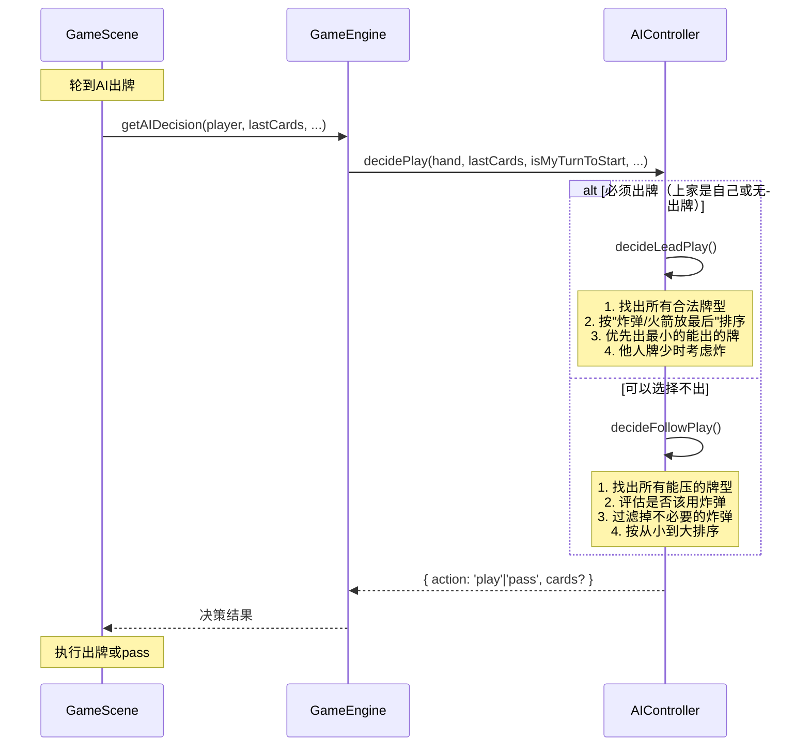
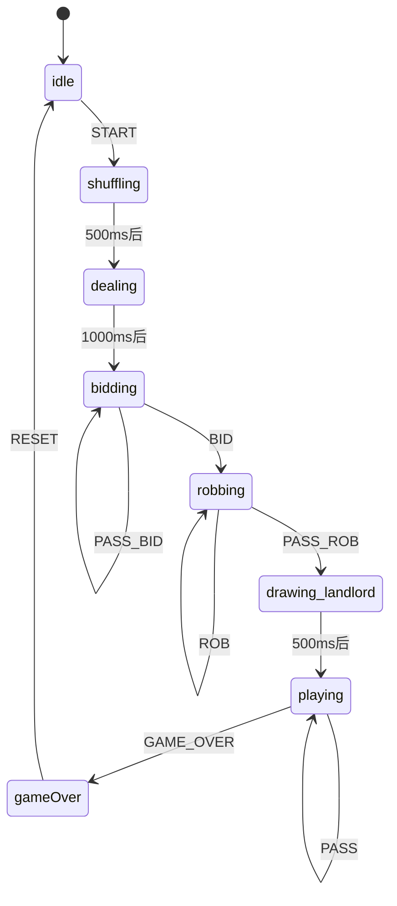

# 斗地主 H5 游戏项目技术分析

## 项目架构总览

### 分层结构

项目采用**经典的分层架构**，各层职责清晰，依赖关系单向：

```
┌─────────────────────────────────────────┐
│              scenes (表现层)             │
│  MenuScene / GameScene / GameOverScene  │
└─────────────────┬───────────────────────┘
                  │
┌─────────────────▼───────────────────────┐
│             states (状态层)              │
│         GameStateMachine (XState)       │
└─────────────────┬───────────────────────┘
                  │
┌─────────────────▼───────────────────────┐
│              utils (业务层)              │
│  GameEngine / CardTypeChecker / Deck    │
│  Card / CardCounter / ScoreManager      │
│  AutoPlayManager                        │
└─────────────────┬───────────────────────┘
                  │
┌─────────────────▼───────────────────────┐
│                ai (AI层)                │
│             AIController                │
└─────────────────┬───────────────────────┘
                  │
┌─────────────────▼───────────────────────┐
│              types (类型层)              │
│  所有枚举、接口定义                      │
└─────────────────────────────────────────┘
```

### 各模块职责与依赖

| 模块 | 职责 | 依赖 | 被依赖 |
|------|------|------|--------|
| **types/** | 定义所有枚举（CardType、GameState、Difficulty等）和接口（ICard、IPlayer、IGameContext等） | 无 | 所有模块 |
| **utils/Card.ts** | 单张牌的实体类，包含比较、排序、花色值计算 | types | CardTypeChecker, Deck, GameEngine, AIController, scenes |
| **utils/CardTypeChecker.ts** | 牌型判定与比较的核心工具类 | types, Card | GameEngine, AIController |
| **utils/Deck.ts** | 牌堆管理：初始化54张牌、洗牌、发牌 | types, Card | GameEngine, scenes |
| **utils/CardCounter.ts** | 记牌器：统计已出牌、剩余牌、炸弹数量 | types, Card | scenes |
| **utils/GameEngine.ts** | 游戏引擎：AI决策调度、出牌验证、胜负判定 | types, CardTypeChecker, AIController, Card | scenes |
| **utils/ScoreManager.ts** | 分数管理：段位计算、本地存储、排行榜 | types | scenes |
| **utils/AutoPlayManager.ts** | 托管功能：包装AI决策供玩家使用 | types, AIController | scenes |
| **ai/AIController.ts** | AI决策：叫地主、抢地主、出牌策略 | types, CardTypeChecker, Card | GameEngine, AutoPlayManager |
| **states/GameStateMachine.ts** | XState状态机：管理游戏流程状态流转 | types, Deck, Card | （当前未被实际使用，scenes自实现状态） |
| **scenes/** | Phaser场景：UI渲染、用户交互、游戏流程调度 | types, utils, ai | 无 |

> **注意**：`GameStateMachine.ts` 虽然存在，但实际游戏流程是在 `GameScene` 中通过 `gamePhase` 字段手动管理的，状态机并未被实际启用。

---

## 牌型判定逻辑详解

### 支持的牌型汇总表

| 牌型名称 | 英文标识 | 牌数 | 判定条件 | canBeat 比较规则 |
|---------|---------|------|---------|-----------------|
| 单张 | SINGLE | 1 | 任意1张牌 | 点数更大即可 |
| 对子 | PAIR | 2 | 2张点数相同 | 点数更大即可 |
| 三张 | TRIPLE | 3 | 3张点数相同 | 点数更大即可 |
| 三带一 | TRIPLE_ONE | 4 | 3张同点 + 1张单牌 | 三张的点数更大即可 |
| 三带二 | TRIPLE_PAIR | 5 | 3张同点 + 1对 | 三张的点数更大即可 |
| 顺子 | STRAIGHT | ≥5 | 5张及以上连续单张（不含2和王） | 长度相同，最大点更大 |
| 连对 | STRAIGHT_PAIR | ≥6 | 3对及以上连续对子（不含2） | 对数相同，最大对更大 |
| 飞机 | PLANE | ≥6 | 2组及以上连续三张（不含2） | 组数相同，最大三张更大 |
| 飞机带单 | PLANE_SINGLE | ≥8 | 飞机 + 相同数量单牌 | 飞机部分的最大三张更大 |
| 飞机带对 | PLANE_PAIR | ≥10 | 飞机 + 相同数量对子 | 飞机部分的最大三张更大 |
| 四带二 | FOUR_TWO | 6 | 4张同点 + 2张单牌 | 四张的点数更大即可 |
| 四带两对 | FOUR_TWO_PAIR | 8 | 4张同点 + 2对 | 四张的点数更大即可 |
| 炸弹 | BOMB | 4 | 4张点数相同 | 1. 可压所有非炸弹/非火箭牌型<br>2. 炸弹之间比点数 |
| 火箭 | ROCKET | 2 | 小王 + 大王 | 可压所有牌型，包括炸弹 |
| 无效 | INVALID | - | 不满足以上任一 | 无法比较 |

### 判定优先级

`CardTypeChecker.check()` 按以下优先级依次判定：

```
火箭 → 炸弹 → 单张 → 对子 → 三张 → 三带一 → 三带二 → 顺子 → 连对 → 飞机 → 飞机带单 → 飞机带对 → 四带二 → 四带两对
```

> **设计考量**：优先判定特殊牌型（火箭、炸弹），避免被普通牌型误判。

### "能否压过"比较逻辑

`CardTypeChecker.compareCombination(a, b)` 判断 b 能否压过 a，逻辑如下：

```typescript
if (b是火箭) return true;               // 火箭最大
if (a是火箭) return false;              // 只有火箭能压火箭
if (b是炸弹) {
  if (a不是炸弹) return true;           // 炸弹压普通牌
  return b.mainValue >= a.mainValue;    // 炸弹之间比大小
}
if (a是炸弹) return false;              // 普通牌不能压炸弹
if (a.type !== b.type || a.length !== b.length) return false; // 牌型/长度不同不能压
return b.mainValue > a.mainValue;       // 同牌型比主值
```

### 关键点说明

1. **顺子/连对/飞机都不含2和王**：`CardRank.TWO` (15) 及以上的点数被排除
2. **飞机不带王**：飞机的三张部分不能包含2和王，但带的单牌/对子可以
3. **三带一的主值是三张的点数**，不是带的那张
4. **四带二不算炸弹**：即使有4张同点，只要带了其他牌就按四带二算，不算炸弹

---

## AI 决策流程图



### AI 决策详细流程

#### 1. 手牌评估（叫地主/抢地主时用）

`evaluateHand()` 给手牌打分（0-100分）：
- 大小王都在 +40分，单大王 +15，单小王 +10
- 每张2 +10分
- 炸弹 +20分，三张 +5分
- 顺子长度奖励，连对长度奖励

#### 2. 叫地主决策（decideBid）

根据分数和当前叫分决定是否叫地主：
- **简单**：≥70分叫300，≥40分且0叫分时50%概率叫100
- **中等**：≥80分叫300，≥60分叫200，≥40分且0叫分时70%概率叫100
- **困难**：≥85分叫300，≥70分叫200，≥50分叫100，≥35分且0叫分时50%概率叫100

#### 3. 出牌决策（decidePlay）

**场景A：必须出牌（isMyTurnToStart = true）**
- 调用 `findAllValidCombinations()` 找出手牌中所有合法牌型
- 排序策略：普通牌按主值升序，炸弹和火箭放最后
- 选择策略：
  1. 如果其他玩家有≤2张牌，可考虑用炸弹
  2. 优先出"出完后剩余牌仍有合法组合"的牌型
  3. 实在不行就出最小的单张

**场景B：可以选择不出（isMyTurnToStart = false）**
- 调用 `findBeatingCombinations()` 找出所有能压过上家的牌型
- 调用 `shouldUseBomb()` 评估是否该用炸弹：
  - 其他玩家牌少（≤2张）→ 必须用
  - 上家出的是炸弹且我有更大的 → 必须用
  - 根据难度和手牌数量决定
- 过滤掉不必要的炸弹/火箭（除非必须用）
- 按主值升序排序，出最小的能压的牌
- 如果没有能压的或不想压 → 返回 pass

#### 4. 两种场景的关键区别

| 维度 | 必须出牌场景 | 可选择不出场景 |
|------|-------------|---------------|
| 出发点 | 如何顺利出完牌 | 是否值得压 |
| 决策范围 | 所有合法牌型 | 仅能压过上家的牌型 |
| 炸弹策略 | 尽量保留（除非他人快赢） | 评估是否必要 |
| 结果 | 一定出牌（play） | 可能出牌也可能pass |
| 最小化策略 | 出最小的合法牌 | 出最小的能压的牌 |

---

## 状态机流转图

### 官方设计的 XState 状态机



### 关键 assign action 说明

| 状态 | 事件 | assign 操作 |
|------|------|------------|
| idle → shuffling | START | 初始化牌堆、发牌、创建3个玩家对象 |
| dealing | entry | 随机选择一个玩家作为叫地主起始玩家 |
| bidding | BID | 记录叫分历史、更新倍数、切换到下一位 |
| bidding | PASS_BID | 记录不叫、3人都不叫则重新开始 |
| robbing | ROB | 倍数x2、更新地主候选、切换到下一位 |
| robbing | PASS_ROB | 所有人都pass且有叫分者 → 确定地主、发地主牌 |
| drawing_landlord | entry | 确定最终地主、合并地主牌 |
| playing | PLAY_CARDS | 从玩家手牌中移除已出牌、记录lastPlayedCards、清空passedPlayers |
| playing | PASS | 记录pass玩家、切换到下一位 |
| gameOver | entry | 计算分数、更新玩家score |

### 实际运行情况

**⚠️ 重要发现**：虽然项目定义了完整的 XState 状态机，但 `GameScene` 中**并未实际使用**，而是通过 `gamePhase` 字段（`'idle' | 'dealing' | 'bidding' | 'robbing' | 'playing' | 'gameOver'`）手动管理状态流转。

---

## 潜在风险点与改进建议

### 风险点1：状态机与实际逻辑脱节

**问题**：`states/GameStateMachine.ts` 定义了完整的 XState 状态机，但 `GameScene` 完全没有使用，而是自己维护了一套 `gamePhase` 状态管理。

```typescript
// GameScene.ts 中实际使用的状态
private gamePhase: 'idle' | 'dealing' | 'bidding' | 'robbing' | 'playing' | 'gameOver' = 'idle';
```

**风险**：
- 两套状态逻辑容易不一致
- 状态机代码相当于"死代码"，维护成本高
- 手动状态管理容易出现边界条件遗漏（如状态非法跳转）

**改进建议**：
1. 要么统一使用 XState 状态机，要么删除状态机文件
2. 如果使用状态机，需要将 GameScene 中的逻辑迁移到状态机的 actions/guards 中

---

### 风险点2：牌型判定的优先级和边界问题

**问题1**：四带二的判定可能与炸弹冲突

```typescript
// 判定顺序：先判炸弹，再判四带二
// 但如果玩家出了 4张同点 + 2张其他牌，会被判为四带二，不是炸弹
// 这是规则允许的，但需要确保UI提示清晰
```

**问题2**：飞机带单/带对的判定过于宽松

```typescript
// isPlaneSingle 中：
const singles = otherCards.slice(0, planeValues.length); 
// 直接取前N张，不验证这些单牌是否包含炸弹/三张
```

**问题3**：顺子/连对/飞机的 "连续" 判定

```typescript
// 正确：3-A是连续的（value 3-14）
// 但代码中过滤了 ≥ CardRank.TWO (15)，所以2不能参与顺子
// 这是正确的斗地主规则
```

**改进建议**：
- 增加单元测试覆盖各种边界牌型
- 飞机带单/带对时验证带的牌是否合法（不能包含三张/炸弹等）

---

### 风险点3：AI 决策的性能问题

**问题**：`findAllValidCombinations()` 采用暴力枚举，当手牌较多时可能产生大量组合。

```typescript
// 例如手牌17张时，顺子枚举是 O(n^2) 的
for (let i = 0; i <= uniqueValues.length - 5; i++) {
  for (let len = 5; len <= uniqueValues.length - i; len++) {
    // ...
  }
}
```

**风险**：
- 虽然17张牌的规模还能接受，但如果后续增加更复杂的AI算法（如博弈树搜索），性能会成为瓶颈
- 每次决策都重新计算所有组合，没有缓存

**改进建议**：
- 对于相同手牌的多次决策，可以缓存组合结果
- 可以考虑用动态规划或剪枝优化组合生成
- 增加难度分级时，不同难度使用不同深度的搜索

---

### 风险点4：Scene 中状态与业务逻辑耦合过重

**问题**：`GameScene.ts` 有近1300行代码，承担了太多职责：
- UI渲染
- 用户交互处理
- 游戏流程调度
- AI调用
- 状态管理

**风险**：
- 难以单元测试
- 修改一处可能影响多处
- 新功能迭代困难

**改进建议**：
- 引入中介者模式（Mediator），将Scene与业务逻辑解耦
- 将出牌验证、流程控制等逻辑移到 GameEngine
- 拆分Scene为更小的组件（如HandCards组件、PlayerInfo组件等）

---

### 风险点5：缺少输入验证和错误处理

**问题**：多处关键路径缺少防御性编程

```typescript
// AIController.ts:125
if (combinations.length === 0) {
  return { action: 'play', cards: [myCards[0]] };  // myCards 可能为空？
}

// GameScene.ts:1182
if (this.lastPlayedCards.length === 0 || this.lastPlayerIndex === this.currentPlayerIndex) {
  const anyCard = player.cards[player.cards.length - 1];  // 假设cards非空
  this.playCards(this.currentPlayerIndex, [anyCard]);
}
```

**风险**：
- 极端情况下可能出现数组越界
- 异常发生时没有降级处理

**改进建议**：
- 增加空值检查
- 关键路径增加 try-catch
- 添加日志便于排查问题

---

## 总结

这个斗地主项目整体架构清晰，核心逻辑（牌型判定、AI决策）实现完整，是一个不错的学习项目。主要优势在于：
- 类型定义完善，TypeScript 使用规范
- 牌型判定逻辑清晰，覆盖了斗地主的主要牌型
- AI决策有一定的策略性，不是简单的随机出牌
- 有完整的分数/段位系统

需要注意的主要是代码质量和可维护性方面的问题，特别是状态管理和Scene的职责划分。
